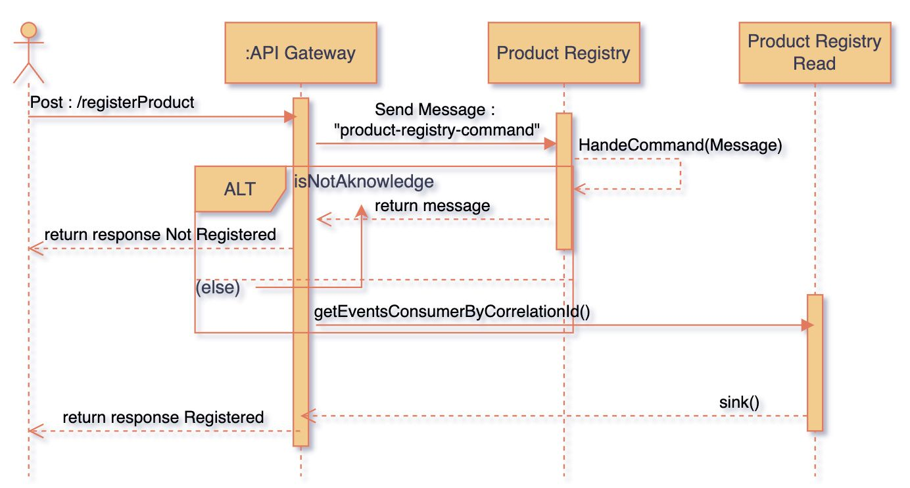

# Development Quality - Order Flow

A comprehensive DDD, CQRS, event-driven application for customer's order and stock management.

This application stack is designed for integrating into an ecosystem needing generic customer and order management.

## Installation

### Dev environment

This software project is designed to be run in a Docker environment. It uses devcontainer specification to provide a consistent development environment.

To run this project in a dev environment, you need to have Docker and Docker Compose installed on your machine.

1. Clone the repository
2. Open the project in Visual Studio Code / IntelliJ IDEA or any other IDE that supports devcontainer.
3. Open the project in the devcontainer.

Supported IDEs :
- Visual Studio Code
- IntelliJ IDEA

#### Pre-requisites

- Docker
- Docker Compose
- Visual Studio Code / IntelliJ IDEA
- Java 17+ (included)
- Gradle 7.3+ (included)
- Node.js 22+ (included)
- pnpm 9.6+ (included)

#### Mono-repository

This project is a mono-repository. It contains multiple packages that are designed to work together.

Applications :
- `apps/of-api-gateway` : the API gateway, exposing the business logic as an HTTP API
- `apps/of-product-registry-microservices` : the product registry microservices, managing products
  - `product.registry` : the command microservice, handling product registry commands
  - `product.registry.read` : the read microservice, handling product registry queries

Libraries :
- `libs/event-sourcing` : a library exposing utilities for event sourcing and typings
- `libs/published-language` : a library exposing the bounded contexts published languages

## Features

This application allows to manage cart (see here item lists), processing orders and observe and manage item stock.
This application does not cover customer management nor order delivery processing.

### API

The API is exposed through the API gateway. It is designed to be used by external applications. It exposes either endpoints as resource (REST), endpoints as commands (RPC) or event streams (SSE).

### Product registry

The product registry is a list of products that can be integrated into a catalog. Each product has a name, a description

### Product catalog

The product catalog is a list of products that can be ordered by customers. Each entry includes a price.

### Cart

The cart is a list of products that a customer wants to order. Each entry includes associated products and quantities.

### Order

The order is a list of products that a customer has ordered. Orders are aggregates handling the order lifecycle.

### Stock

The stock is a list of products that are available for ordering. Each entry includes associated products and quantities.

## Documentation

[Go to index](./doc/index.md)

## Tâche 0 - Mise en place de l'environement de travail :

- Création d'une version realese 0.1.0 du code
- Applications des règles de contribution gitflow

## Tâche 1 - Amélioration de la gestion des erreurs asynchrones :

- Création de la classe ProductRegistryError pour les erreurs de traitement
- Ajout de l'interface pour les messages de canal
- Intégration de ProductRegistryEvent et de ProductRegistryError dans les messages
- Mise à jour des mappages JSON pour mettre la nouvelle classe d'erreur

## Tâche 2 - Refonte du flux d'événements :

- Suppression de l'émission d'événements côté écriture
- Modification de l'API Gateway pour interroger le côté lecture
- Adaptation de l'Emitter pour transmettre l'ID de corrélation au service de lecture
- Déplacement de la logique de ProductRegistryEventEmitter vers un microservice de lecture
- Ajout de la configuration pour le délai d'attente dans l'API Gateway
- Création d'un nouveau projet gradle libs/shared pour le code commun
- Refactorisation du point de terminaison de lecture

## Tâche 3 - Gestion des modifications :

- Création des branches distinctes pour chaque fonctionnalité
- Historique Git propre
- Descriptions claires pour les merge requests

**Ces modifications visent à améliorer :**

- La robustesse du système
- La séparation des responsabilités
- La maintenabilité du code 
- Et la documentation et la compréhension du système

[diagramme de séquence](./doc/DiagrammeSequence.jpg)

## Installation

TODO
    
## Authors

- Thibaud FAURIE :
  - [@thibaud.faurie (Private GitLab)](https://gitlab.cloud0.openrichmedia.org/thibaud.faurie)
  - [@thibaud-faurie (LinkedIn)](https://www.linkedin.com/in/thibaud-faurie/)

